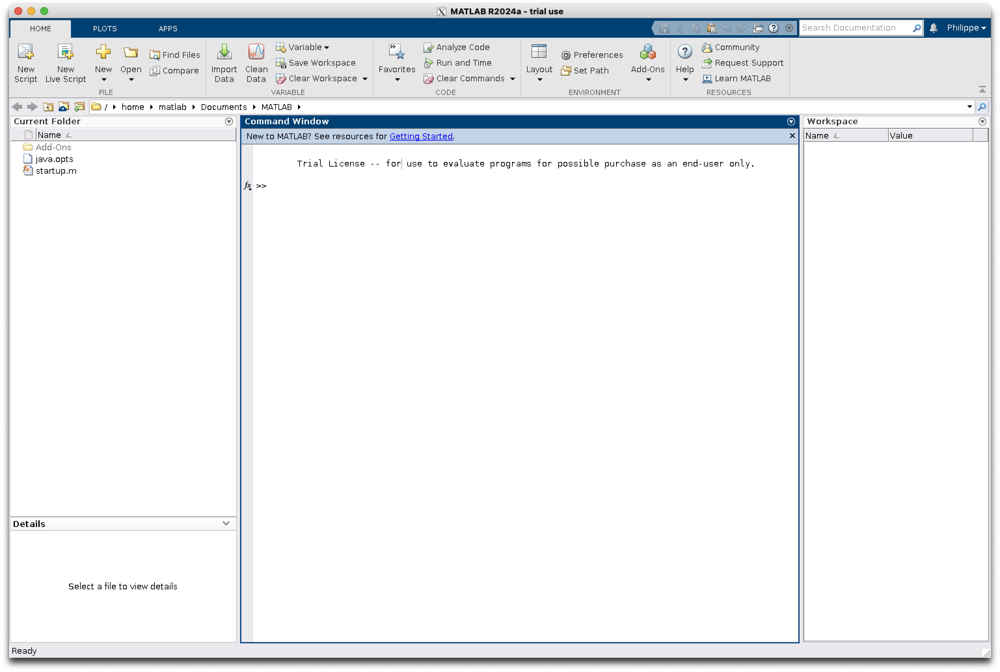

# Run Matlab in a container

**Build**:
```bash
docker build -t my-matlab-container .
```

**Run**:
```bash
sudo xhost +local:docker
docker run -it --rm -e DISPLAY=host.docker.internal:0 -v /tmp/.X11-unix:/tmp/.X11-unix:ro --shm-size=512M my-matlab-container
```

With the `java.opts` the background color issue disappeared




I used this image https://hub.docker.com/r/mathworks/matlab to a create a custom Docker image from the MATLAB container base image

