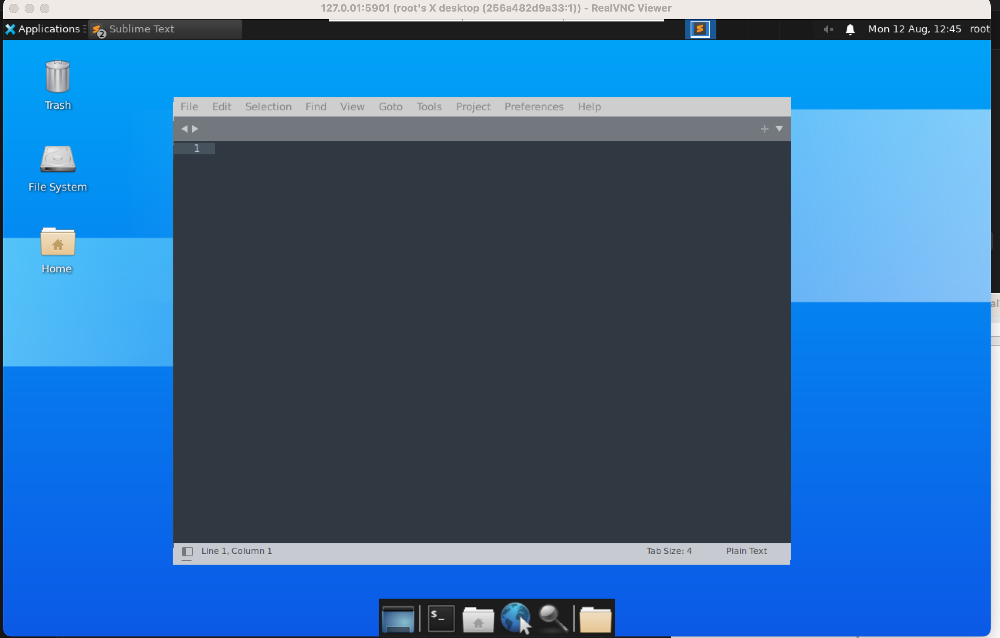

### Build the docker image

```docker build -t sublime-vnc .```

### Run the image

```docker run -p 5901:5901 sublime-vnc```

### Connect Using a VNC Viewer

- Open the VNC viewer and enter the address: <IP_ADDRESS>:5901 (e.g., localhost:5901).
- When prompted for the password, enter the same password in the Dockerfile. e.g "YOUR_VNC_PASSWORD"
- Once the VNC viewer connection is established, you will be able to find the application(<b>Submlime Text</b>) via the application finder


