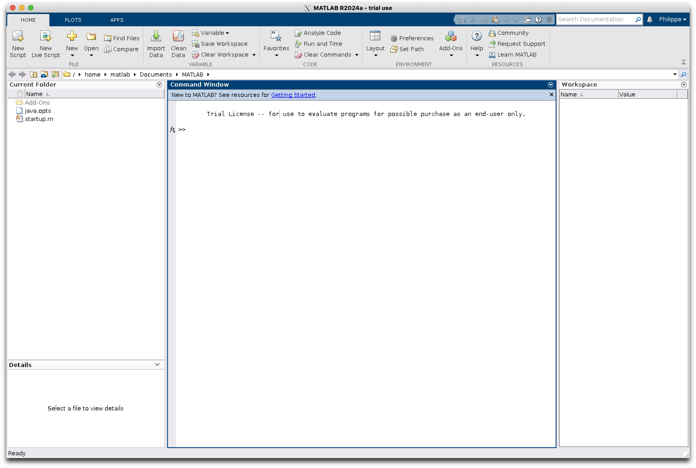

# Run Matlab in a container

## Build and run with the `docker` CLI

**Build**:
```bash
docker build -t my-matlab-container .
```

**Run**:
```bash
sudo xhost +local:docker
docker run -it --rm -e DISPLAY=host.docker.internal:0 -v /tmp/.X11-unix:/tmp/.X11-unix:ro --shm-size=512M my-matlab-container
```

With the `java.opts` the background color issue disappeared




I used this image https://hub.docker.com/r/mathworks/matlab to a create a custom Docker image from the MATLAB container base image

## Build and run with the `docker compose` command

You will use the `compose.yml` for that.

To run the Compose project in detached mode, use the following command:
```bash
docker compose up -d
```

You can use `docker compose build` to build the project before running it.

You can use `docker compose up -d --build` to build and run the project in the foreground.

To stop the Compose project, use the following command:
```bash
docker compose down
```

This line in the `compose.yml` file, allows to mount a volume on the `./documents directory`:

```yaml
- ./documents:/documents
```

You can check this with the Docker Desktop GUI:

**Select the container `matlab-1`**:


**Go to the Files tab**:


> More about compose [here](https://docs.docker.com/compose/)